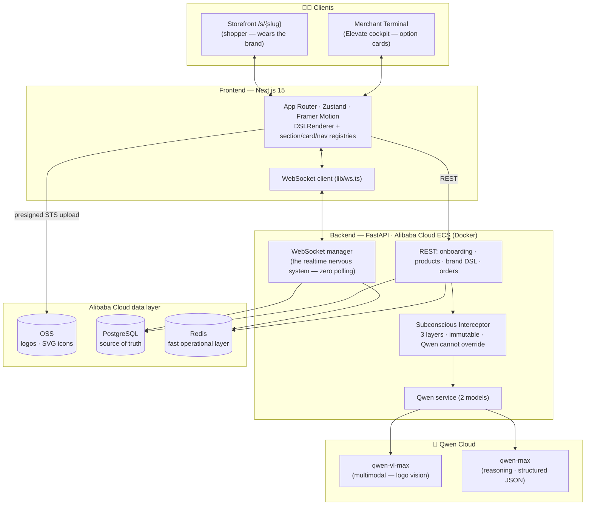
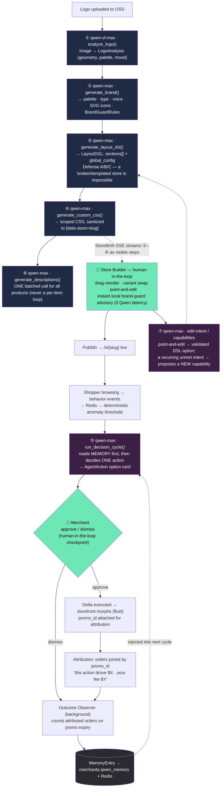
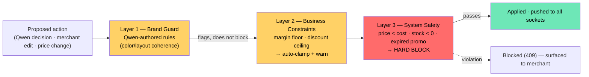

# Elevate — Architecture

> **The codebase is the body. Qwen is the brain.**
> Elevate is an AI-native commerce platform where Qwen isn't a feature bolted
> onto a store — it *builds* the store from a logo, *renders* a layout unique to
> the brand, *runs* the store from live behavior, and *learns* what works for
> each store over time. The merchant stays in control through option cards, not
> chat: **human-in-the-loop at every critical decision** (Track 4: Autopilot Agent).

These diagrams render natively on GitHub. To export a PNG for the demo/Devpost,
paste any block into <https://mermaid.live> or use the VS Code Mermaid extension.

---

## 1. System overview

How a request flows through the two services and the Alibaba Cloud layer.

**Design rules made explicit here:**
- Frontend and backend are strictly separated — no shared code.
- All live data flows over WebSocket; REST only for onboarding, uploads, health.
- FastAPI never touches file bytes — the browser uploads logos straight to OSS
  via a short-lived STS token (serverless functions must not stream binaries).
- Redis is never the only copy of anything important; Postgres is the truth.

**Deployment:** the backend runs on **Alibaba Cloud ECS** — a single instance
running the FastAPI service, PostgreSQL, and Redis as Docker containers — with
**Alibaba OSS** for logo/asset storage (`analytics-brain/app/routers/upload.py`
uses the `oss2` SDK) and **Qwen Cloud** for all model calls. The frontend can be
hosted anywhere (only the backend must run on Alibaba per the hackathon rules).

---

## 2. The Qwen cognitive loop — 6+ distinct call types, 2 models

This is the heart of the "60%" (Technical Depth + Innovation). One logo becomes
a fully-branded, self-running store, and **the loop closes** so Qwen gets smarter
per store: action → outcome → memory → a better next decision.

**Why the loop matters for judging:** Track 4 rewards an agent that (1) automates a
real workflow, (2) has meaningful human checkpoints, (3) *learns over time*, and
(4) does the heavy lifting itself. The green nodes are the human checkpoints; the
`MemoryEntry → next cycle` edge is the learning; the six purple/blue calls are Qwen
doing the work — not orchestrating simpler tools.

---

## 3. The Subconscious Interceptor — 3 layers, immutable

Every proposed action (Qwen's *or* the merchant's) passes through all three layers
before it can take effect. Qwen authored Layer 1 at brand-generation time but can
never override the stack.

---

## 4. Data strategy (two layers)

| Layer | Store | Holds |
|---|---|---|
| **Postgres (RDS)** — source of truth | durable | merchants, products, orders, brand profiles (`brand_tokens` JSONB incl. `layout_dsl` + `custom_css`), `agent_actions`, `qwen_memory` |
| **Redis (Tair)** — fast operational | best-effort cache | behavior events, product velocity, pending actions, `layout_dsl:{id}`, `merchant_memory:{id}`, WS/session state |

Rule: if it must exist tomorrow, it goes to Postgres first, then Redis for speed.

---

## 5. Distinctness guarantee — 40 logos → 40 distinct stores

Three layers make a broken or templated store impossible, even with Qwen offline:

- **A · `coerce_variant`** — type-aware; a hallucinated or cross-type variant falls
  to that slot's type default.
- **B · `normalize_dsl`** — structural rules the renderer *alone* trusts (≤1 leading
  hero, ≥1 grid, 2–5 sections, no adjacent banners).
- **C · `fallback_dsl_from_token`** — deterministic and **brand-seeded**
  (`hash(store_name + mood + industry)`), so stores stay distinct if the Qwen call
  fails entirely.

_Post-hackathon (designed, not built): `action_outcomes` embeddings for cross-store
RAG — "what worked for similar brands" injected at decision time (pgvector + ivfflat)._
