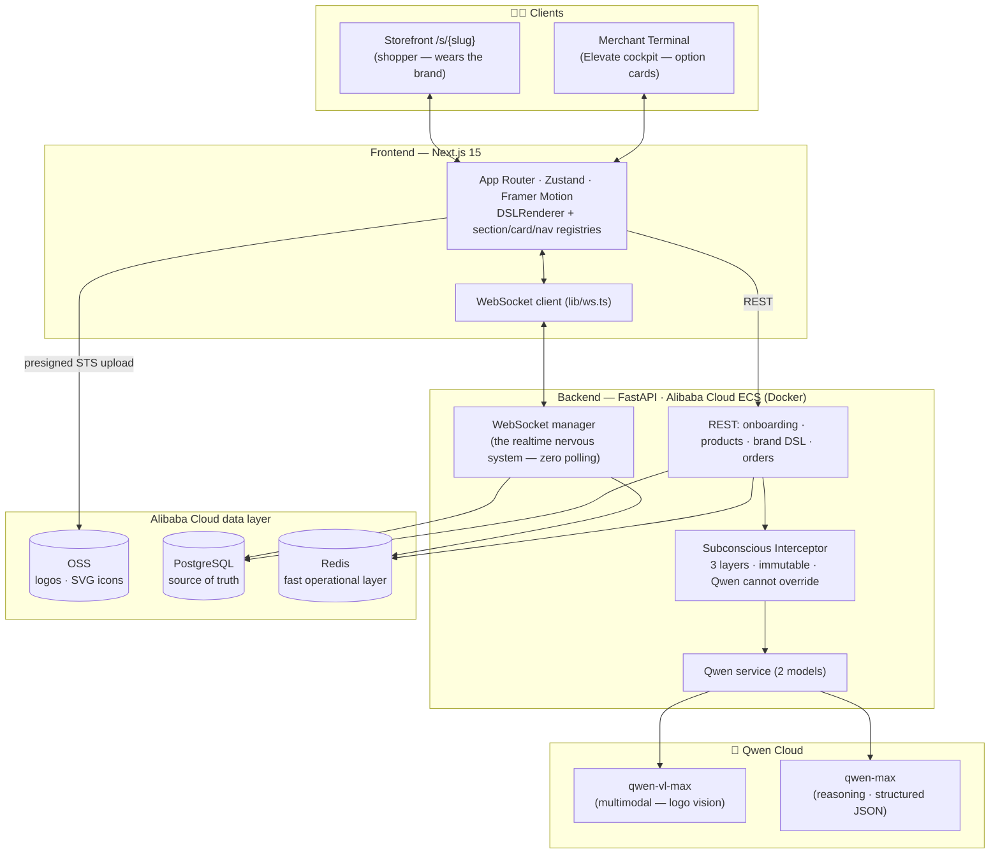
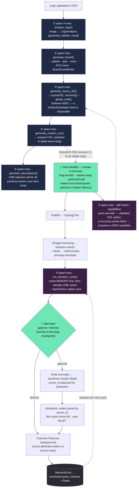
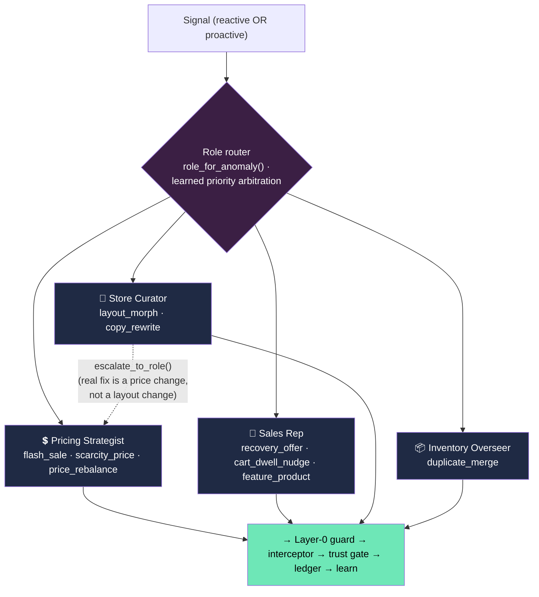
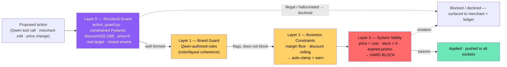
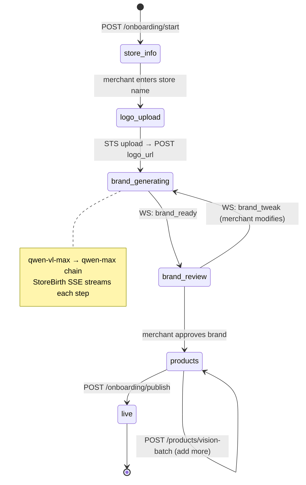
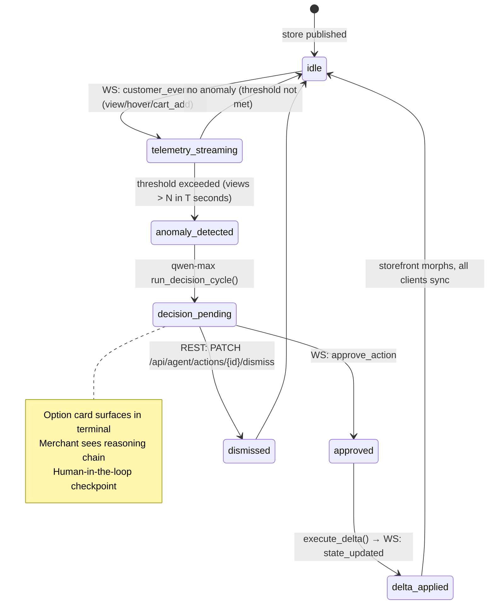
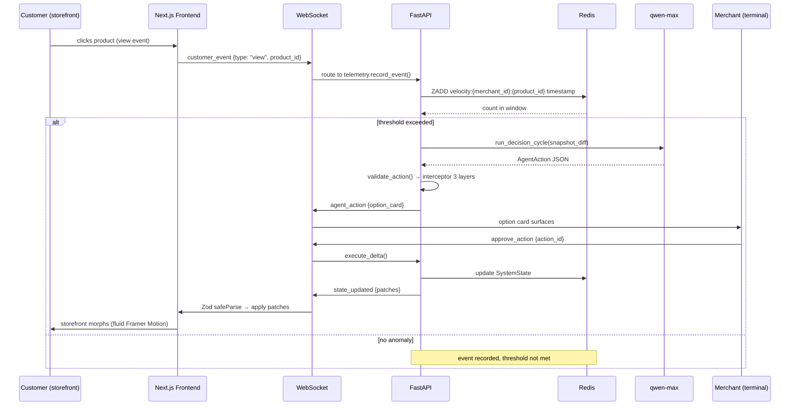

# Elevate — Architecture

> **The codebase is the body. Qwen is the brain.**
> Elevate is an AI-native commerce platform where Qwen isn't a feature bolted
> onto a store — it *builds* the store from a logo, *renders* a layout unique to
> the brand, *runs* the store from live behavior, and *learns* what works for
> each store over time. The merchant stays in control through option cards, not
> chat: **human-in-the-loop at every critical decision** (Track 4: Autopilot Agent).
>
> "Runs the store" is concrete: a **swarm of four role-scoped Qwen specialists**
> (§2c) that reason, escalate to each other, and adapt from per-store learning —
> behind a **structural guard + 3-layer interceptor** they cannot override (§3), a
> **graduated-trust gate** (§3b), and a **tamper-evident decision ledger** (§3b).

These diagrams render natively on GitHub. To export a PNG for the demo/Devpost,
paste any block into <https://mermaid.live> or use the VS Code Mermaid extension.

---

## 1. System overview

How a request flows through the two services and the Alibaba Cloud layer.



**Design rules made explicit here:**
- Frontend and backend are strictly separated — no shared code.
- All live data flows over WebSocket; REST only for onboarding, uploads, health.
- FastAPI never touches file bytes — the browser uploads logos straight to OSS
  via a short-lived STS token (serverless functions must not stream binaries).
- Redis is never the only copy of anything important; Postgres is the truth.

**Deployment:** the backend runs on **Alibaba Cloud ECS** — a single instance
running the FastAPI service, PostgreSQL, and Redis as Docker containers — with
**Alibaba OSS** for logo/asset storage (`analytics-brain/app/routers/upload.py`
uses the `oss2` SDK) and **Qwen Cloud** for all model calls. The frontend can be
hosted anywhere (only the backend must run on Alibaba per the hackathon rules).

---

## 2. The Qwen cognitive loop — 7 distinct call types, 2 models

This is the heart of the "60%" (Technical Depth + Innovation). One logo becomes
a fully-branded, self-running store, and **the loop closes** so Qwen gets smarter
per store: action → outcome → memory → a better next decision.



**Why the loop matters for judging:** Track 4 rewards an agent that (1) automates a
real workflow, (2) has meaningful human checkpoints, (3) *learns over time*, and
(4) does the heavy lifting itself. The green nodes are the human checkpoints; the
`MemoryEntry → next cycle` edge is the learning; the six purple/blue calls are Qwen
doing the work — not orchestrating simpler tools.

---

## 2b. Memory loop — full lifecycle (auditable end-to-end)

The persistent memory loop is the system's learning mechanism. Every step below
is traceable through named functions, DB tables, and Redis keys.

### Source 1: Merchant edits → memory

```
Merchant edits product (e.g. changes price from $80 → $95)
  → PATCH /products/{id}
  → Router detects changed fields, calls write_memory()
  → write_memory() creates MemoryEntry:
      action_type = "merchant_edit"
      field = "price"
      old_value = "80"
      new_value = "95"
      summary = "Merchant raised price from $80 to $95"
  → INSERT into merchants.qwen_memory (Postgres, durable)
  → SET merchant_memory:{id} (Redis, fast mirror)
  → Capped at 20 entries per merchant (FIFO eviction)
  → If write fails: caught in try/except, logged, edit still succeeds
```

### Source 2: Outcome observation → memory

```
Merchant approves Qwen action (e.g. flash_sale at 15%)
  → AgentAction created with promo_id attached
  → schedule_observation(action_id, expires_at_ms) fires background task
  → On promo expiry: observe_outcome() runs
  → Counts orders joined by promo_id (attributed conversions)
  → summarize_outcome(count, revenue) → "flash_sale at 15% → 3 orders, $127"
  → write_memory() creates MemoryEntry:
      action_type = "outcome"
      summary = "flash_sale at 15% → 3 orders, $127"
  → Same Postgres + Redis write path as Source 1
```

### Memory → next Qwen call (the learning)

```
Any Qwen call that benefits from memory (vision, descriptions, decisions):
  → get_memory(merchant_id) reads from Redis (O(1)), falls back to Postgres
  → build_memory_context(entries, limit=8) formats the last 8 as plain text:
      "The merchant raised price from $80 to $95"
      "flash_sale at 15% → 3 orders, $127 revenue"
  → Context string injected into Qwen prompt (zero extra tokens when empty)
  → Qwen adapts: names, prices, descriptions, decisions reflect merchant preferences
  → The cycle closes: action → outcome → memory → better next action
```

### Where to audit each step

| Step | File | Function |
|------|------|----------|
| Edit triggers memory | `app/routers/products.py` | PATCH handler calls `write_memory()` |
| Memory write | `app/services/memory.py` | `write_memory()` — Postgres + Redis |
| Memory read | `app/services/memory.py` | `get_memory()` — Redis first, Postgres fallback |
| Prompt injection | `app/services/memory.py` | `build_memory_context()` — formats entries as text |
| Outcome scheduling | `app/services/outcome_observer.py` | `schedule_observation()` — background task |
| Outcome counting | `app/services/outcome_observer.py` | `observe_outcome()` — joins orders by `promo_id` |
| Outcome summary | `app/services/outcome_observer.py` | `summarize_outcome()` — plain-text result |
| DB table | `app/models/db_models.py` | `MerchantDB.qwen_memory` — JSONB column |
| Tests | `tests/test_memory.py` | Write/read/context/failure resilience |
| Integration tests | `tests/test_memory_live.py` | Postgres + Redis round-trip |
| Outcome tests | `tests/test_outcome_observer.py` | Scheduling + counting + summary |

---

## 2c. The Qwen swarm — four role-scoped specialists

The decision cycle (call ⑤ above) is not one generalist prompt holding all nine
tools. Each trigger routes to a **named role that owns a disjoint subset of tools
and cannot call outside it** — a hallucinated cross-domain action isn't caught
after the fact, the tool simply isn't on that role's menu. It's the same single
`qwen-max` call per event either way: the scoping adds structure, not tokens
(`get_role_tools` filters `DECISION_TOOLS` before the call).



Two behaviors make this a *team*, not four isolated prompts:

- **Escalation** (`qwen_roles.py · ESCALATE_TOOL`) — a role can hand a decision to
  another specialist when the real fix is outside its own tools. The Store Curator,
  seeing a product with real interest but no conversions, escalates to the Pricing
  Strategist via a typed `escalate_to_role` tool instead of forcing a layout change
  that won't help.
- **Priority arbitration tuned by learning** (`learning.compute_effective_priority`)
  — each role has a base priority; this store's own approval history nudges it up or
  down, so competing signals resolve the way *this* merchant has taught the system to.

### Per-role learning — the measurable, visible half of the loop

Beyond remembering *what happened* (§2b), the swarm quantifies *what to do
differently per role*. `learning.py` aggregates how this merchant has resolved a
role's past proposals — kept vs. dismissed, and the discount level kept vs.
rejected — into a directive injected into that role's next prompt:

> *"Learned for this store: the merchant kept 2 of 6 recent Pricing Strategist
> proposals. Kept offers averaged 9% off vs. 35% for dismissed ones — lead with
> about 9%."*

Proposals measurably converge on what this store accepts. The stance is stored on
each decision's `context_snapshot` and shown on the Decision Trace page, so the
learning is *visible*, not asserted — and it stays silent below 3 resolved
proposals (no wasted tokens, no dishonest claim). A stateless one-shot agent
cannot produce this; it has no history.

| Step | File | Function |
|------|------|----------|
| Role definitions + scoped tools | `app/services/qwen_roles.py` | `QwenRole`, `get_role_tools`, `ESCALATE_TOOL` |
| Trigger → role routing | `app/services/qwen_roles.py` | `role_for_anomaly`, `role_for_action_type` |
| Structural guard | `app/services/action_guard.py` | `validate_tool_args` |
| Per-role learning | `app/services/learning.py` | `compute_role_learning`, `render_learned_stance`, `compute_effective_priority` |

---

## 3. The safety stack — a structural guard + a 3-layer interceptor, immutable

Every proposed action (Qwen's *or* the merchant's) passes through the whole stack
before it can take effect. Layer 0 makes a structurally-illegal action
*unrepresentable* (a hallucinated value can't even become an action); Layers 1–3
then govern a well-formed-but-aggressive action. Qwen authored Layer 1 at
brand-generation time but can never override any of it — structural safety **and**
runtime safety, belt and suspenders.



**Layer 0 vs. the interceptor — a deliberate split.** The interceptor *clamps* a
valid-but-too-aggressive value (a 60% discount pulled to the merchant's 40%
ceiling) and *hard-blocks* on live business state (below cost). Layer 0 rejects a
value that is not aggressive but *nonsensical* — a negative or >100% discount, a
zero price, a phantom product id, a self-contradictory merge — the fingerprint of
a hallucinated tool call, before it can become an `AgentAction` at all. Neither
layer is redundant: a bad value that slipped past Layer 0 still hits the
interceptor; a merely-aggressive value that passes Layer 0 still gets clamped.

---

## 3b. Graduated trust + the Decision Ledger

**Graduated autonomy** (`autopilot_trust.py`). Human-in-the-loop is the default,
but trust is *earned per (store, product)*. Only `price_rebalance` — and only a
move already inside the interceptor-clamped safe band — can auto-apply once a
trust streak is earned; every other action type, and every rebalance below the
threshold or outside the band, still takes the option-card path. **Trust only ever
removes the gate — it never widens the safe range** — and a single dismissal resets
the streak. An auto-applied move surfaces as an `action_auto_executed` FYI card, so
nothing happens invisibly. Full autonomy everywhere would score *worse* on Track 4;
the design is deliberately bounded.

**The Decision Ledger** (`receipts.py`). Every lifecycle transition — proposed,
blocked, approved, executed, dismissed — is written to a hash-chained, HMAC-signed
log in Postgres. Because each entry attests to the action row's *real current
values*, a later check detects not just reordering or deletion of the log (standard
hash-chain) but a quietly-edited action row *after the fact* (`verify_row_consistency`).
Both approval surfaces — the REST routes and the MCP tools — write a ledger entry,
so neither can mutate an action's status without a receipt. Verify offline:
`python scripts/verify_ledger.py <store>`.

| Concern | File | Function |
|---|---|---|
| Earned autonomy | `app/services/autopilot_trust.py` | `get_trust_streak`, `should_auto_apply`, `update_trust_streak` |
| Audit chain | `app/services/receipts.py` | `append_receipt`, `verify_chain`, `verify_row_consistency` |
| Offline verifier | `scripts/verify_ledger.py` | CLI over a store's full chain |

---

## 4. Data strategy (two layers)

| Layer | Store | Holds |
|---|---|---|
| **Postgres (RDS)** — source of truth | durable | merchants, products, orders, brand profiles (`brand_tokens` JSONB incl. `layout_dsl` + `custom_css`), `agent_actions`, `qwen_memory` |
| **Redis (Tair)** — fast operational | best-effort cache | behavior events, product velocity, pending actions, `layout_dsl:{id}`, `merchant_memory:{id}`, WS/session state |

Rule: if it must exist tomorrow, it goes to Postgres first, then Redis for speed.

---

## 5. Distinctness guarantee — 40 logos → 40 distinct stores

Three layers make a broken or templated store impossible, even with Qwen offline:

- **A · `coerce_variant`** — type-aware; a hallucinated or cross-type variant falls
  to that slot's type default.
- **B · `normalize_dsl`** — structural rules the renderer *alone* trusts (≤1 leading
  hero, ≥1 grid, 2–5 sections, no adjacent banners).
- **C · `fallback_dsl_from_token`** — deterministic and **brand-seeded**
  (`hash(store_name + mood + industry)`), so stores stay distinct if the Qwen call
  fails entirely.

_Post-hackathon (designed, not built): `action_outcomes` embeddings for cross-store
RAG — "what worked for similar brands" injected at decision time (pgvector + ivfflat)._

---

## 6. State machines — onboarding and live decision cycle

Two state machines govern the system. Every state transition is triggered by a
named WebSocket event or REST call — no implicit transitions.

### Onboarding state machine



### Live store decision cycle



### WebSocket event map

Verified against `WSEventType` (schemas.py) and every `push_to_*` call site
— this is the wire protocol as it actually runs, not as first planned.

```
CLIENT → SERVER (/ws/terminal/{merchant_id})
  approve_action        merchant approves an option card — applies the
                         patches, broadcasts state_updated to all clients
  stage_preview         sandbox preview — returns a non-persisted state_updated
  rollback               undo the last delta — state_updated (rollback: true)

CLIENT → SERVER (/ws/storefront/{merchant_id})
  customer_event        storefront browse interaction (view, hover, cart_add,
                         purchase, abandon) — feeds telemetry.record_event()

SERVER → CLIENT (terminal)
  agent_action           Qwen proposed an action — option card surfaces.
                         Pushed directly from decision_engine.run_decision_cycle
                         (reactive / recovery / proactive-review triggers all
                         share this one push path) — not a reply to a client
                         message.
  action_blocked         interceptor Layer 3 hard block, or approve_action
                         arriving before the terminal sent its first message
  action_expired         a pending action's TTL elapsed — auto-dismissed,
                         card removed from the feed
  qwen_fallback          a Qwen call failed and a deterministic fallback ran
                         — surfaced as a transparency toast, not an error

SERVER → CLIENT (both)
  state_updated          delta applied — storefront morphs, terminal refreshes
  brand_ready            brand generation complete — onboarding advances

Dismiss is REST (`PATCH /api/agent/actions/{id}/dismiss`), not a WS event —
the client→server map above is exhaustive for both socket routes.

Declared in WSEventType but not currently pushed anywhere: decision_ready
(superseded by agent_action), action_clamped, anomaly_detected,
snapshot_update. brand_warning is intentionally never pushed — Layer 1
warnings are computed client-side from the pre-generated BrandGuardRules
at interaction time (zero round-trip, see "Brand Warning" below), not
server-pushed. promo_activated appears in earlier planning text but was
never added to the WSEventType enum.
```

---

## 7. WebSocket event flow — end to end



